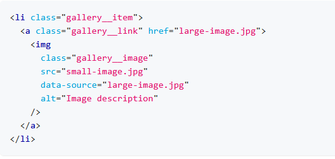
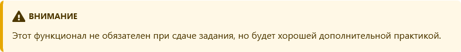

# Домашнее задание №8

## GO-IT-JS 08

---

### Критерии приема
* Создан репозиторий goit-js-hw-08.

* При сдаче домашней работы есть две ссылки: на исходные файлы и рабочую страницу на GitHub Pages.

* При посещении живой страницы задания, в консоли нету ошибок и предупреждений.

* Имена переменных и функций понятные, описательные.

* Код отформатирован **Prettier**.
### Стартовые файлы
[Скачай стартовые файлы](https://minhaskamal.github.io/DownGit/#/home?url=https://github.com/goitacademy/javascript-homework/tree/main/v2/07/src) с базовой разметкой, готовыми стилями и подключенными файлами скриптов для каждого задания. Скопируй их себе в проект.  

В файле **gallery-items.js** есть массив **galleryItems** , который содержит объекты с информацией о изображениях: маленькое (превью), оригинальное (большое) и описание. Мы уже подключили его к каждому из JS-файлов проекта.

---

# Задание 1 - галерея изображений
Создай галерею с возможностью клика по её элементам и просмотра полноразмерного изображения в модальном окне. Посмотри демо видео работы галереи.[Video](https://user-images.githubusercontent.com/17479434/127711719-4e293f5b-fbaa-4851-8671-fc841963d961.mp4)
Выполняй это задание в файлах 01-gallery.html и  gallery.js  Разбей его на несколько подзадач:
* Создание и рендер разметки по массиву данных 01-gallery.html и  galleryItems  и предоставленному шаблону элемента галереи.
* Реализация делегирования на ul.gallery  и получение url большого изображения.
* Подключение скрипта и стилей библиотеки модального окна [basicLightbox](https://basiclightbox.electerious.com/).
Используй [CDN](https://www.jsdelivr.com/package/npm/basiclightbox?path=dist) сервис [jsdelivr](https://www.jsdelivr.com/package/npm/basiclightbox?path=dist) и добавь в проект ссылки на минифицированные (.min) файлы библиотеки.
* Открытие модального окна по клику на элементе галереи. Для этого ознакомься с [документацией](https://github.com/electerious/basicLightbox#readme) и [примерами](https://basiclightbox.electerious.com/).
* Замена значения атрибута src элемента \ в модальном окне перед открытием. Используй готовую разметку модального окна с изображением из примеров библиотеки basicLightbox.

# Разметка элемента галереи
Ссылка на оригинальное изображение должна храниться в data-атрибуте source на элементе \, и указываться в href ссылки. Не добавляй другие HTML теги или CSS классы кроме тех, что есть в этом шаблон.  
Для вставки изображения в Markdown-файле (.md) с использованием HTML-тега \, вы можете использовать следующий синтаксис:

markdown

  
Обрати внимание на то, что изображение обернуто в ссылку, а значит при клике по умолчанию пользователь будет перенаправлен на другую страницу. Запрети это поведение по умолчанию.  

  

Добавь закрытие модального окна по нажатию клавиши Escape. Сделай так, чтобы прослушивание клавиатуры было только пока открыто модальное окно. У библиотеки [basicLightbox](https://basiclightbox.electerious.com/) есть метод для программного закрытия модального окна.

